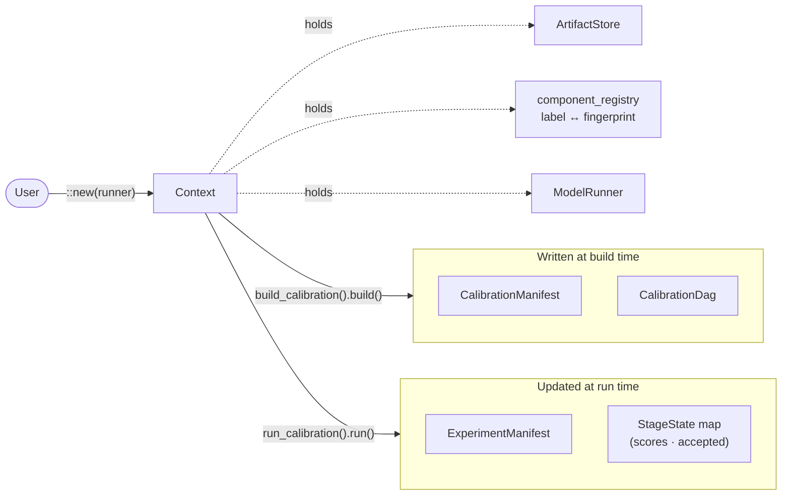

[← TOC](README.md) | [Next: Calibrator Construction →](02-calibrator-construction.md)

---

## 1. Context Orchestrator

`Context` is the central orchestrator for all runtime operations. It is the only component that holds live callables, open caches, RNG state, and registered component labels. It exposes build and run functionality through trait extensions.

**Responsibilities of `Context`:**
- Owns the `CalibrationDag` and the runtime `StageState` map, which is the authoritative store for per-stage particle score maps.
- Holds and manages `CalibrationManifest` (static, created at build) and `ExperimentManifest` (dynamic, updated throughout a run).
- Registers all user-supplied components (scorers and data targets) under string labels. Struct-based components derive `ComponentFingerprint` automatically; closure-based components use `VersionedFn` with an explicit version tag (§11).
- Knows the seed parameter name for stochastic models.
- Builds target objects via registered `TargetBuilder` labels.
- Manages the artifact store: writes and retrieves serialized model outputs and posteriors.
- Provides `build_calibration()` → `CalibrationBuilder` (validates component labels, constructs the `CalibrationDag` and `CalibrationManifest`, and commits them back into `Context` on `.build()`).
- Provides `run_calibration()` and `simulate()` methods that populate the `ExperimentManifest` (executing and referencing the DAG directly on the `Context`, updating the manifest in real time).
- Propagates all diagnostics and errors upward in real time rather than burying them in nested stage internals.

```rust
pub struct Context {
    /// Static serialized record to regenerate a calibration routine
    pub calibration_manifest: CalibrationManifest,
    /// Live serialized record showing model simulations and calibrations performed with the runner via Context
    pub experiment_manifest: ExperimentManifest,
    /// DAG map of edges and nodes built by CalibrationMnaifest, populated during calibration run, and referenced inside ExperimentManifest
    pub dag:                  CalibrationDag,
    /// Runtime state per DAG node. Each StageState owns the score map for its particles.
    pub stage_states:         HashMap<StageId, StageState>,
    /// Access to large generated objects during run referenced in the ExperimentManifest
    pub artifact_store:       Box<dyn ArtifactStore>,
    /// Policy for populating generated objects inside the ExperimnetManifest and ArtifactStore
    pub checkpoint_policy:    CheckpointPolicy,
    /// label → component fingerprint (for stage wiring and cache key lookup).
    component_registry:       HashMap<String, Fingerprint>,
    /// component fingerprint → label (for audit output and manifest display).
    component_labels:         HashMap<Fingerprint, String>,
    /// Self-versioning through git commit of a local project and the version of calibrationtools used
    pub version: ContextVersionReference,
}
```

The `Context` is intentionally not serializable. Only `CalibrationManifest` and `ExperimentManifest` cross serialization boundaries. A "dehydrated" manifest can be re-hydrated into a live `Context` via `Context::from_manifest`.



### Construction

`Context::new(runner)` is the sole constructor. The model runner is the only required argument; it is stored internally without a label, because a `Context` owns exactly one runner. All other configuration is optional and applied through trait extension methods before calling `build_calibration`.

```rust
impl Context {
    /// Construct a Context with a model runner.
    /// Defaults: `LocalArtifactStore("artifacts/")`, `CheckpointPolicy::ParticleBatch`.
    pub fn new(runner: impl ModelRunnerProtocol + 'static) -> Self;
    /// Re-construct a Context from an old manifest
    pub fn from_manifest(manifest: ExperimentManifest) -> Self;
}
```

### `ContextConfigExt` — optional infrastructure overrides

```rust
pub enum ModelType {
    Stochastic,
    Deterministic
}

/// Extension trait for overriding Context infrastructure defaults.
pub trait ContextConfigExt {
    fn artifact_store(self, store: impl ArtifactStore + 'static) -> Self;
    fn checkpoint(self, policy: CheckpointPolicy) -> Self;
    /// Declare the name of the stochastic RNG seed parameter inside the model runner config.
    /// Stores model type as stochastic
    fn seed_param(self, name: &str) -> Self;
    /// Set base entropy value for initiating seeds and RNGs
    fn base_entropy(self, entropy: u64) -> Self;
    /// Set the default values for the model configuration
    fn set_defaults(self, defaults: Config) -> Self;
}

impl ContextConfigExt for Context { /* ... */ }
```

---

[← TOC](README.md) | [Next: Calibrator Construction →](02-calibrator-construction.md)
