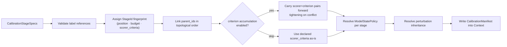

[← Context Orchestrator](01-context-orchestrator.md) | [TOC](README.md) | [Next: Simulation System and DAG Stages →](03-simulation-system-and-dag-stages.md)

---

## 2. Calibrator Construction
`CalibrationBuilder` is the front end handler for connecting the calibration specification with the `Context` simulation functionality, generating a graph of ABC-SMC rejection sampling stages.

### 2.1 `ContextCalibrationExt` — calibration declaration

`build_calibration` returns a `CalibrationBuilder` that borrows `Context` mutably for its lifetime. Calling `.build()` on the builder validates all label references, constructs the `CalibrationDag` and `CalibrationManifest`, and writes them back into `Context`. 

```rust
/// Extension trait for declaring a calibration on a Context.
pub trait ContextCalibrationExt {
    pub fn build_calibration(&mut self) -> CalibrationBuilder<'_>;
    /// Return stage-level diagnostics for a specific stage, or the posterior leaf
    /// when `stage_id` is `None`. The stage must have completed.
    pub fn diagnostics(&self, stage_id: Option<StageId>) -> &DiagnosticsStageResult;
    /// Return a rolled-up summary across all completed calibration stages.
    pub fn calibration_diagnostics(&self) -> CalibrationDiagnosticsResult;
    /// Return a read-only slice of accepted particles. Optionally return for a single counterfactual variant
    /// label within a completed stage. Returns an empty slice when the label is absent from the population.
    pub fn current_population<'a>(
        &'a self,
        stage_id:      &StageId,
        counterfactual_label: Option<&str>,
    ) -> PopulationSlice<'a>;
}

impl ContextCalibrationExt for Context { /* ... */ }
```

Calling `.build()` returns a `Result<(), CalibrationBuildError>`.

Automatic stage construction on call:
1. Assigns a content-addressed `StageId` fingerprint to each node from its position, budget, and score criteria requirements.
2. Links `parent_id` in topological order (first entry is DAG root, last is the posterior node).
3. Unless `skip_score_criterion_accumulation()` was called, accumulates `(scorer, criterion)` pairs across stages in topological order, filling each `StageNode::scorer_criteria` with the effective carried set (see **Criterion Accumulation** in [9](09-scoreacceptancecriterion.md)).
4. Resolves `StageNode::model_state_policy` for each stage: uses `CalibrationStageSpec::model_state_policy` when `Some`, otherwise falls back to the calibration-wide default set by `CalibrationBuilder::default_model_state_policy`, otherwise `ModelStatePolicy::None`.
5. Populates `CalibrationManifest::stage_map` and `stage_ids`.
6. Populates the perturbation inheritance policy and perturbation types as possible.
7. Writes the resulting `CalibrationManifest`



```rust
/// Returned by `ctx.build_calibration()`. Borrows ctx mutably.
pub struct CalibrationBuilder<'ctx> { /* opaque */ }

impl<'ctx> CalibrationBuilder<'ctx> {
    // Optionally add priors by dictionary or supply a filepath to be parsed
    pub fn with_priors(self, priors: HashMap<String, serde_json::Value>) -> Self;
    pub fn with_priors_from_file(self, path: Path) -> Self;
    /// Default scorer applied to stages whose `scorer_criteria` contains an empty-string
    /// sentinel — i.e. stages built via the `From<(usize, ScoreAcceptanceCriterion)>` shorthand.
    /// Required when any stage uses that shorthand; optional otherwise.
    pub fn default_scorer<GQ: GeneratedQuantity, T: Target>(self, scorer: &ScorerRef<GQ, T>) -> Self;
    /// Declare rejection sampling stages in order (DAG root first, leaf last).
    /// Each item is a `CalibrationStageSpec`. A `(usize, ScoreAcceptanceCriterion)` tuple
    /// may be passed via `From` as a shorthand using the default scorer.
    /// Unless `skip_score_criterion_accumulation()` is called, `build()` carries forward
    /// accumulated `(scorer, criterion)` pairs from each stage into all subsequent stages
    /// (see **Criterion Accumulation** below).
    pub fn abc_stages(self, stages: impl IntoIterator<Item = impl Into<CalibrationStageSpec>>) -> Self;
    /// If setting a test number of max proposals
    pub fn max_proposals(self, n: usize) -> Self;
    /// Call to run a prior predictive check at build time and, optionally, construct the score acceptance criteria for each stage from a distribution generated as a vector of floats bounded from 0 to 1.
    pub fn prior_predictive_check(self, sample_size: usize, build_criteria: Option<Vec<Quantiles>>) -> Self
    /// Link a registered target to this calibration by its `TargetRef`. At `build()` time
    /// the builder fingerprint and serialized input are written into
    /// `CalibrationManifest::target_refs` keyed by `target.label`. At runtime, `Context`
    /// builds (or retrieves from cache) the target value and supplies it to every scorer
    /// whose `StageScorerSpec::target_fingerprint` matches, falling back to type-matching
    /// when unset (§8.1). May be called more than once for calibrations that declare
    /// multiple targets.
    pub fn add_target_data<T: Target>(self, target: TargetRef<T>) -> Self;
    /// Declare a counterfactual group applied during every run of this calibration.
    /// Both `Iterator` and `Selector` modes are accepted. Stored in `CalibrationManifest::counterfactuals`.
    ///
    /// `build()` validates that no key in any variant `FlatParticle` appears in the prior set
    /// (i.e., is also a calibrated parameter). Calibrating a parameter that a counterfactual
    /// variant simultaneously fixes to a constant is undefined; any such overlap produces
    /// `CalibrationBuildError::CounterfactualParamClash`.
    ///
    /// For `Selector` mode, the variant count causes `build()` to append a `ModelSelector`
    /// component into the effective perturbation kernel (§6, §10).
    pub fn counterfactuals(self, group: CounterfactualGroup) -> Self;
    /// Set a calibration-wide default `ModelStatePolicy` applied to every stage whose
    /// `CalibrationStageSpec::model_state_policy` is `None`. Stages that declare their
    /// own policy via `CalibrationStageSpec::with_model_state_policy` take precedence.
    /// When neither is set the policy defaults to `ModelStatePolicy::None`.
    pub fn default_model_state_policy(self, policy: ModelStatePolicy) -> Self;
    /// Opt out of automatic criterion accumulation across stages.
    /// By default, `build()` carries forward effective `(scorer, criterion)` pairs from
    /// each stage to all subsequent stages, automatically tightening criteria when a more
    /// restrictive version is encountered for the same scorer (see **Criterion Accumulation**
    /// below). Calling this method disables that behaviour: each stage's `scorer_criteria`
    /// is used exactly as declared, with no constraints inherited from earlier stages.
    pub fn skip_score_criterion_accumulation(self) -> Self;
    /// Validate, construct `CalibrationDag` + `CalibrationManifest`, and commit into context.
    pub fn build(self) -> Result<(), CalibrationBuildError>;

    /// Build and immediately execute the calibration with the given seed.
    /// Equivalent to `.build()?` followed by `ctx.run_calibration().seed(seed).run().await?`.
    /// Returns `Err` on build validation failure or runtime error.
    /// Use `.build()` directly when you need to inspect the manifest or configure
    /// run options (e.g. `resume_from`, `stages`) before executing.
    pub async fn build_and_run(self, seed: Seed) -> Result<ExperimentManifest, RunError>;
}
```

The specification for a particular stage in the `CalibrationManifest` requires knowledge of the score criteria to accept particles, how many to accept, how many to propose, and how to perturb proposed particles. Other information, such as sampling and priors, exist at higher levels in the manifest.

```rust
/// A scorer paired with its acceptance criterion and an optional target fingerprint,
/// for one entry within a `CalibrationStageSpec`.
///
/// **Preferred construction** — typed, via `ScorerRef<GQ, T>` returned by `register_scorer`:
/// - `(&ScorerRef<GQ, T>, ScoreAcceptanceCriterion)` — no target pinning.
/// - `(&ScorerRef<GQ, T>, ScoreAcceptanceCriterion, &TargetRef<T>)` — explicit scorer–target
///   pairing enforced at compile time; `T` must match for both refs.
///
/// **Fallback construction** — string label only (retained for compatibility):
/// - `(&str, ScoreAcceptanceCriterion)` — scorer resolved by label at `build()`.
/// - `(&str, ScoreAcceptanceCriterion, &TargetRef<T>)` — scorer by label; target by fingerprint.
///   `build()` checks `type T` compatibility at runtime, returning
///   `CalibrationBuildError::TargetTypeMismatch` on a mismatch.
#[derive(Debug, Clone)]
pub struct StageScorerSpec {
    /// Human-readable label of the scorer (from registration). Used for audit and diagnostics.
    pub scorer_label:       String,
    /// Fingerprint of the `ScorerRef` this spec was constructed from. When `Some`,
    /// `build()` resolves the scorer by fingerprint rather than by label, making the wiring
    /// robust to label renames. When `None` (string-only construction), `build()` falls
    /// back to label-based lookup.
    pub scorer_fingerprint: Option<Fingerprint>,
    pub criterion:          ScoreAcceptanceCriterion,
    /// Fingerprint of the `TargetRef` this scorer is pinned to. When `Some`,
    /// `Context` looks up the cached target by this fingerprint and passes it as
    /// the `targets` slice, bypassing type-based fallback dispatch.
    /// When `None`, Context falls back to matching by `type T` (unambiguous only
    /// when at most one declared target has the scorer's `type T`).
    pub target_fingerprint: Option<Fingerprint>,
}

/// Typed construction — scorer identity by fingerprint, no target pinning.
impl<GQ: GeneratedQuantity, T: Target> From<(&ScorerRef<GQ, T>, ScoreAcceptanceCriterion)> for StageScorerSpec {
    fn from((scorer, criterion): (&ScorerRef<GQ, T>, ScoreAcceptanceCriterion)) -> Self {
        StageScorerSpec {
            scorer_label:       scorer.label.clone(),
            scorer_fingerprint: Some(scorer.fingerprint.clone()),
            criterion,
            target_fingerprint: None,
        }
    }
}

/// Typed construction — scorer and target both identity-pinned; compiler enforces `T` match.
impl<GQ: GeneratedQuantity, T: Target> From<(&ScorerRef<GQ, T>, ScoreAcceptanceCriterion, &TargetRef<T>)> for StageScorerSpec {
    fn from((scorer, criterion, target_ref): (&ScorerRef<GQ, T>, ScoreAcceptanceCriterion, &TargetRef<T>)) -> Self {
        StageScorerSpec {
            scorer_label:       scorer.label.clone(),
            scorer_fingerprint: Some(scorer.fingerprint.clone()),
            criterion,
            target_fingerprint: Some(target_ref.fingerprint.clone()),
        }
    }
}

/// String-label fallback — scorer resolved by label at `build()` time; no compile-time check.
impl From<(&str, ScoreAcceptanceCriterion)> for StageScorerSpec {
    fn from((label, criterion): (&str, ScoreAcceptanceCriterion)) -> Self {
        StageScorerSpec {
            scorer_label:       label.to_string(),
            scorer_fingerprint: None,
            criterion,
            target_fingerprint: None,
        }
    }
}

/// String-label fallback — scorer by label, target by fingerprint; `T` checked at `build()` time.
impl<T: Target> From<(&str, ScoreAcceptanceCriterion, &TargetRef<T>)> for StageScorerSpec {
    fn from((label, criterion, target_ref): (&str, ScoreAcceptanceCriterion, &TargetRef<T>)) -> Self {
        StageScorerSpec {
            scorer_label:       label.to_string(),
            scorer_fingerprint: None,
            criterion,
            target_fingerprint: Some(target_ref.fingerprint.clone()),
        }
    }
}

/// Specification for a single rejection sampling stage.
#[derive(Debug, Clone)]
pub struct CalibrationStageSpec {
    /// The population size goal for the stage
    pub target_accepted: usize,
    /// One or more (scorer, criterion) pairs applied at this stage.
    /// Each scorer is evaluated independently; a particle must satisfy **all** pairs
    /// to be accepted. When this vec contains an empty-string sentinel label, `build()`
    /// resolves it to the default scorer declared on `CalibrationBuilder::scorer`;
    /// `build()` returns `NoScorerDeclared` when neither a scorer nor a criterion is set.
    pub scorer_criteria:     Vec<StageScorerSpec>,
    /// Number of proposals to exhaust before exiting stage without reaching `target_accepted` particles in the final accepted population
    pub budget:              Option<usize>,
    /// Per-stage perturbation kernel override. When `Some`, this kernel is used for
    /// this stage instead of `CalibrationManifest::root_perturbation_kernel`.
    pub perturbation_override: Option<PerturbationType>,
    /// How this stage handles intermediate model states. When `None`, the calibration-wide
    /// default declared via `CalibrationBuilder::default_model_state_policy` is used;
    /// falls back to `ModelStatePolicy::None` when neither is set.
    pub model_state_policy:  Option<ModelStatePolicy>,
}

impl CalibrationStageSpec {
    /// Construct a stage with one or more scorer–criterion pairs.
    /// Each item must implement `Into<StageScorerSpec>`; typed `(&ScorerRef<GQ, T>, ScoreAcceptanceCriterion)`
    /// tuples are the preferred form (compile-time identity, no label lookup at `build()`).
    pub fn new(
        target_accepted: usize,
        scorer_criteria: impl IntoIterator<Item = impl Into<StageScorerSpec>>,
    ) -> Self

    /// Append a (scorer, criterion) pair to this stage's criteria list.
    pub fn with_simulation_criterion<GQ: GeneratedQuantity, T: Target>(
        self,
        scorer:    &ScorerRef<GQ, T>,
        criterion: ScoreAcceptanceCriterion,
    ) -> Self

    /// Append a (scorer, criterion, target) triple. Pins this scorer to a specific
    /// `TargetRef`, with the compiler enforcing that the scorer's `type T` matches
    /// the target's `type T`. `Context` dispatches the cached target by fingerprint
    /// at runtime.
    pub fn with_data_based_criterion<GQ: GeneratedQuantity, T: Target>(
        self,
        scorer:     &ScorerRef<GQ, T>,
        criterion:  ScoreAcceptanceCriterion,
        target_ref: &TargetRef<T>,
    ) -> Self

    /// Apply a per-stage perturbation kernel override for this stage.
    pub fn perturbation_override(self, kernel: PerturbationType) -> Self

    /// Set the model-state policy for this stage, overriding any calibration-wide default.
    pub fn with_model_state_policy(self, policy: ModelStatePolicy) -> Self
}

/// Convenience: construct a single-scorer stage using the `CalibrationBuilder`'s
/// declared default scorer and the given criterion. An empty-string sentinel label
/// is stored in `scorer_criteria`; `build()` replaces it with the default scorer label.
impl From<(usize, ScoreAcceptanceCriterion)> for CalibrationStageSpec {
    fn from((n, criterion): (usize, ScoreAcceptanceCriterion)) -> Self {
        CalibrationStageSpec {
            target_accepted:  n,
            scorer_criteria:  vec![StageScorerSpec { scorer_label: String::new(), criterion, target_fingerprint: None }],
            budget: None,
            perturbation_override: None,
            model_state_policy: None,
        }
    }
}


/// Convenience: construct an unscored stage specification to be paired to a build with criterion
impl From<usize> for CalibrationStageSpec {
    fn from(n: usize) -> CalibrationStageSpec {
        CalibrationStageSpec {
            target_accepted:  n,
            scorer_criteria:  vec![],
            budget: None,
            perturbation_override: None,
            model_state_policy: None,
        }
    }
}
```


`CalibrationBuildError` covers every failure mode of `build()` that may occur due to incompatible perturbations, priors, or scoring criteria.

```rust
#[derive(Debug)]
pub enum CalibrationBuildError {
    /// A scorer label referenced in a stage spec or as the default was not registered.
    UnknownScorerLabel(String),
    /// A `TargetRef` passed to `add_target_data` was not registered on this `Context`.
    /// This occurs when a `TargetRef` obtained from a different `Context` instance is used.
    UnregisteredTarget { label: String, fingerprint: Fingerprint },
    /// A `ScorerRef` used in a stage spec was not registered on this `Context`.
    /// Analogous to `UnregisteredTarget`; occurs when a `ScorerRef` obtained from a
    /// different `Context` instance is used.
    UnregisteredScorer { label: String, fingerprint: Fingerprint },
    /// The `type T` of a scorer does not match the `type T` of the target it was
    /// pinned to via `StageScorerSpec::target_fingerprint`. Unreachable when both
    /// scorer and target are wired via typed refs (`ScorerRef<GQ, T>` + `TargetRef<T>`),
    /// since the compiler enforces a matching `T` at the call site. Occurs only when
    /// the scorer was wired by string label (fallback construction path).
    TargetTypeMismatch { stage_idx: usize, scorer_label: String, target_label: String },
    /// No default scorer was declared and at least one stage has no per-stage override.
    NoScorerDeclared,
    /// A parameter key in a counterfactual variant overlaps with a calibrated prior parameter.
    /// Remove the parameter from the prior or from the counterfactual variant.
    CounterfactualParamClash { param: String, variant_label: String },
    /// The effective kernel's parameter set does not match the calibrated parameters at a stage.
    KernelParamMismatch { stage_idx: usize, kernel_params: Vec<String>, calibrated_params: Vec<String> },
    /// The prior set contains no free parameters.
    EmptyPrior,
    /// Criterion accumulation produced an unsatisfiable window for a scorer at a stage.
    /// Occurs when `NumericWindow` or `RangeWindow` bounds from two stages produce
    /// `low > high` after intersection.
    CriterionWindowCollapse { stage_idx: usize, scorer_label: String },
}
```

---
### 2.2 Core Type System

All public traits require the following minimum bounds. These are blanket-implemented so users do not need to name them explicitly when declaring concrete types.

```rust
use serde::{Deserialize, Serialize};

/// Minimum bounds every score value must satisfy.
pub trait ScoreValue: PartialOrd + Clone + Serialize + for<'de> Deserialize<'de> + Send + Sync + 'static {}
impl<T: PartialOrd + Clone + Serialize + for<'de> Deserialize<'de> + Send + Sync + 'static> ScoreValue for T {}

/// Minimum bounds on model outputs.
pub trait GeneratedQuantity: Clone + Serialize + for<'de> Deserialize<'de> + Send + Sync + 'static {}
impl<T: Clone + Serialize + for<'de> Deserialize<'de> + Send + Sync + 'static> GeneratedQuantity for T {}

/// Minimum bounds on calibration targets.
pub trait Target: Clone + Serialize + for<'de> Deserialize<'de> + Send + Sync + 'static {}
impl<T: Clone + Serialize + for<'de> Deserialize<'de> + Send + Sync + 'static> Target for T {}
```

**Score values are type-erased** at DAG boundaries. This keeps DAG node declarations uniform at the cost of runtime type assertions for score comparisons. The error propagation system ([§15](15-abc-rejection-sampling-execution.md)) is responsible for surfacing type panics to the user clearly rather than silently swallowing them.


---

### 2.3 CalibrationManifest and ExperimentManifest

**Lifecycle:**
- `CalibrationManifest` is created by `Context::build_calibration().build()` and remains static across all runs of that calibration. It is the authoritative ruleset — priors, stages, perturbation strategy, scorers, targets, and counterfactuals are all fixed here.
- `ExperimentManifest` is created at the start of each `Context::run_calibration()` call and owns the full runtime record: seed, timing, stage status, checkpoints, artifact refs, realized kernel descriptors, and diagnostics.
- `Context` can be queried for either manifest or for individual stage checkpoints without loading the full manifest.


```rust
#[derive(Debug, Clone, Serialize, Deserialize)]
pub struct CalibrationManifest {
    pub schema_version:           String,
    pub id:                       Fingerprint,
    /// Particle schema and prior definitions.
    pub prior_set:                     serde_json::Value,
    /// Root perturbation kernel applied across all stages (see §6).
    /// Scale values are set from prior statistics at `build()` time and updated between
    /// stages by `PerturbationType::adapt`. Per-stage overrides live in `StageNode::perturbation_override`.
    pub root_perturbation_kernel:      PerturbationType,
    /// How the root schema propagates and adapts across DAG stages (see §6).
    pub perturbation_inheritance:      PerturbationInheritance,
    /// Scorer component labels and their fingerprints.
    pub scorer_refs:              HashMap<String, Fingerprint>,
    /// Target build specs and fingerprints.
    pub target_refs:              HashMap<String, serde_json::Value>,
    /// Counterfactual group declared at build time, if any.
    /// Validated for parameter clashes against `prior_set` during `build()`.
    pub counterfactuals:          Option<CounterfactualGroup>,
    /// Stage map: stage ID → node metadata.
    pub stage_map:                HashMap<StageId, StageNode>,
    pub stage_ids:                 Vec<StageId>,
    pub metadata:                 Option<serde_json::Value>,
}

#[derive(Debug, Serialize, Deserialize)]
pub struct ExperimentManifest {
    pub id:                       uuid::Uuid,
    pub calibration_fingerprint:  Fingerprint,
    pub context_fingerprint:      Fingerprint,
    pub selected_stages:          Vec<StageId>,
    pub base_seed:                     Seed,
    pub started_at:               chrono::DateTime<chrono::Utc>,
    pub completed_at:             Option<chrono::DateTime<chrono::Utc>>,
    pub stage_status:             HashMap<StageId, StageStatus>,
    /// References to out-of-line artifact store entries for calibration stage posteriors.
    pub posterior_artifacts:      HashMap<StageId, ArtifactRef>,
    /// Artifact refs accumulated from post-calibration simulation runs, in execution order.
    pub simulation_artifacts:     Vec<ArtifactRef>,
    pub stage_checkpoints:        HashMap<StageId, StageCheckpoint>,
    /// Realized perturbation kernels with adapted scale values, written by `Context`
    /// between stages. Keyed by `StageId`; provides a per-run audit trail.
    /// Mirrors `StageNode::realized_kernel` but survives serialization boundaries.
    pub realized_kernels:         HashMap<StageId, PerturbationType>,
    pub diagnostics:              HashMap<StageId, DiagnosticsStageResult>,
}

#[derive(Debug, Clone, Serialize, Deserialize)]
pub enum StageStatus {
    Pending,
    Running   { started_at: chrono::DateTime<chrono::Utc> },
    Completed { finished_at: chrono::DateTime<chrono::Utc> },
    Failed    { error: String },
    BudgetExhausted { accepted: usize, required: usize },
}

/// Diary entries are keyed to an ExperimentManifest but stored in a
/// separate append-only file to avoid re-serializing the full manifest.
#[derive(Debug, Serialize, Deserialize)]
pub struct DiaryEntry {
    pub experiment_id: uuid::Uuid,
    pub author:        Option<String>,
    pub timestamp:     chrono::DateTime<chrono::Utc>,
    pub note:          String,
    pub stage_id:      Option<StageId>,
}
```

---

[← Context Orchestrator](01-context-orchestrator.md) | [TOC](README.md) | [Next: Simulation System and DAG Stages →](03-simulation-system-and-dag-stages.md)
