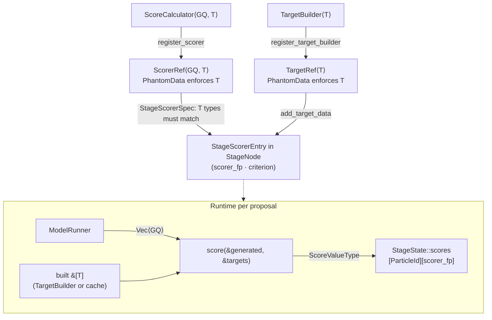

[← NestedSuffixParser and ParticleError](07-nestedsuffixparser-and-particleerror.md) | [TOC](README.md) | [Next: ScoreAcceptanceCriterion →](09-scoreacceptancecriterion.md)

---

## 8. ScoreCalculator


Score calculation requires **at least one generated quantity**. Targets are optional; a scorer that compares to a target simply returns `None` when no targets are provided rather than an error.

All `ScoreValueType`s produced by a `ScoreCalculator` are `Serialize + Deserialize`. This is enforced by the `ScoreValue` bound ([§2.2](02-calibrator-construction.md)).

Targets that arrive into score calculators are pre-processed either through a `TargetBuilder` (see [§8.1](#81-targetbuilder)) or registered as a static value via `register_target` (§11.3), and are therefore one-to-one compatible with generated quantities. Because multiple score calculators can be applied to a single stage, calling `add_target_data` more than once on `CalibrationBuilder` does not impede accessing multiple target data sources inside the same calibration stage.

A user is responsible for declaring new score calculators according to the following functionality:
```rust
// Struct-based scorers derive ComponentFingerprint (see §11):
// #[derive(ComponentFingerprint, Serialize, Deserialize)]
// pub struct MyScorer { ... }
//
// Closure-based scorers use VersionedFn<GQ, T, F> (see §11).

pub trait ScoreCalculator: ComponentFingerprint + Send + Sync {
    type GQ: GeneratedQuantity;
    type T:  Target;

    /// Score type is erased at the DAG level but must satisfy ScoreValue.
    /// Returns None for a soft scoring failure (not a ScoringError).
    fn score(
        &self,
        generated: &[Self::GQ],   // must be non-empty
        targets:   &[Self::T],    // may be empty
    ) -> Result<Option<ScoreValueType>, ScoringError>;

    /// Optional: score and return a provenance record capturing target snapshot,
    /// processed output snapshot, and named distance components. The default
    /// implementation calls `score` and wraps with empty component and snapshot fields.
    /// Override to expose intermediate values for diagnostics and co-documentation.
    fn score_with_provenance(
        &self,
        generated: &[Self::GQ],
        targets:   &[Self::T],
    ) -> Result<Option<(ScoreValueType, ScoreProvenance)>, ScoringError> {
        Ok(self.score(generated, targets)?.map(|s| {
            let prov = ScoreProvenance {
                // scorer_label is the human-readable label resolved from
                // Context::component_labels at provenance construction time.
                scorer_label:     String::new(), // filled by Context from component_labels
                targets_snapshot: serde_json::to_value(targets).unwrap_or_default(),
                outputs_snapshot: serde_json::to_value(generated).unwrap_or_default(),
                components:       HashMap::new(),
                score:            s.clone(),
            };
            (s, prov)
        }))
    }

    /// Required: return static documentation for this scorer.
    /// Use `ScoreDocumentation::minimal("description")` for minimal compliance.
    /// Written into `CalibrationManifest::scorer_refs` at build time alongside
    /// the target data snapshot, co-locating the distance definition and the data
    /// it operates on without consulting source code (see §11).
    fn documentation(&self) -> ScoreDocumentation;
}

/// The erased score value used at DAG boundaries.
#[derive(Debug, Clone, PartialEq, Serialize, Deserialize)]
#[serde(tag = "kind", content = "value")]
pub enum ScoreValueType {
    Numeric(f64),
    Range { low: f64, high: f64 },
}

// Users can return arbitrary errors associated with the defined score calculator during run
#[derive(Debug, Serialize, Deserialize)]
pub enum ScoringError {
    NumericalFailure(String),
}

/// Provenance record emitted by `ScoreCalculator::score_with_provenance`.
/// Captures the target snapshot, processed model output snapshot, and any named
/// distance components that compose the final score. Stored in `StageState::score_provenances`
/// keyed by `ParticleId` to make the scoring computation transparent at the particle level.
#[derive(Debug, Clone, Serialize, Deserialize)]
pub struct ScoreProvenance {
    /// String label of the scorer that produced this record.
    pub scorer_label:     String,
    /// Serialized snapshot of the target values passed to the scorer.
    pub targets_snapshot: serde_json::Value,
    /// Serialized snapshot of the processed model outputs used in distance computation.
    pub outputs_snapshot: serde_json::Value,
    /// Named distance components if the scorer decomposes the score.
    /// e.g. `{"mae_peak": 12.3, "mae_tail": 4.1}`.
    pub components:       HashMap<String, f64>,
    pub score:            ScoreValueType,
}

/// Static documentation emitted by `ScoreCalculator::documentation()`.
/// Written into `CalibrationManifest::scorer_refs` at build time.
/// `Context::write_scorer_docs()` renders all registered scorers' documentation
/// alongside a target data snapshot, enabling live creation of scorer docs from
/// the defined distance function.
#[derive(Debug, Clone, Serialize, Deserialize)]
pub struct ScoreDocumentation {
    pub description:   String,
    /// Human-readable description of the expected target structure and units.
    pub target_schema: String,
    /// Human-readable description of the expected generated-quantity structure.
    pub output_schema: String,
    /// Named distance components and what each measures.
    pub components:    HashMap<String, String>,
}

impl ScoreDocumentation {
    /// Minimal compliant documentation for scorers that do not require full schema description.
    pub fn minimal(description: impl Into<String>) -> Self {
        Self {
            description:   description.into(),
            target_schema: String::new(),
            output_schema: String::new(),
            components:    HashMap::new(),
        }
    }
}
```

Score calculators are reusable across stages as long as the `GQ` and `T` types match. Different score calculators used across stages or within the same stage do not have to satisfy the same condition.
When `score_with_provenance` is implemented, `Context` stores each returned `ScoreProvenance`
in `StageState::score_provenances` keyed by `ParticleId`. These records drive the target-vs-output
rendering in the diagnostics stage ([§3](03-simulation-system-and-dag-stages.md)) and are accessible via `context.diagnostics(Some(stage_id))`.
`ScoreDocumentation`, when provided, is attached to the `CalibrationManifest` and serialized alongside
target data snapshots, so the distance definition and the data it operates on are always co-located
in the manifest. The relationship between model outputs, targets, and the score is therefore legible
at the provenance level without consulting the source code.

### `ScorerRef` — typed scorer handle

`register_scorer` returns a `ScorerRef<GQ, T>` that parallels the `TargetRef<T>` returned by the target registration methods. It carries the scorer's component fingerprint and phantom types `GQ` and `T`, enabling compile-time type-checked wiring in `StageScorerSpec` and `CalibrationBuilder::default_scorer` (§2.1). When a `ScorerRef<GQ, T>` and a `TargetRef<T>` are passed to the same `StageScorerSpec` constructor, the compiler enforces that the scorer's `type T` matches the target's `type T`, making `CalibrationBuildError::TargetTypeMismatch` unreachable for that path.

```rust
/// A typed handle to a registered scorer. Returned by
/// `ContextRegistrationExt::register_scorer` (§11.3).
/// Carries the component fingerprint of the scorer and phantom types `GQ` and `T`
/// that enable compile-time type-checking when pairing scorers with targets via
/// `StageScorerSpec` (§2.1).
///
/// `ScorerRef<GQ, T>` can only be obtained from `register_scorer`; the private
/// `_phantom` field prevents direct construction.
pub struct ScorerRef<GQ: GeneratedQuantity, T: Target> {
    pub label:       String,
    pub fingerprint: Fingerprint,
    _phantom:        PhantomData<(fn() -> GQ, fn() -> T)>,
}
```



---

### 8.1 TargetBuilder

A `TargetBuilder` constructs a `Target` value from a serializable raw input. It serves as the processing stage between raw observed data (a CSV row, a JSON payload, a file path) and the `&[Self::T]` slice that arrives in `ScoreCalculator::score`. A `TargetBuilder` is the appropriate choice when target preparation involves non-trivial logic — preprocessing, normalization, filtering, or format conversion — that must be fingerprinted and cached independently. Registering a plain value via `register_target` ([§11.3](11-fingerprinting-and-caching-strategy.md#113-registration-and-label-separation)) is the alternative when no construction step is required.

```rust
/// Trait for constructing a `Target` value from a serializable raw input.
/// Registered via `ContextRegistrationExt::register_target_builder` (§11.3).
/// Must implement `ComponentFingerprint` for caching (see §11).
///
/// Struct-based builders derive `ComponentFingerprint` automatically (Track A).
/// Closure-based builders use `VersionedTargetFn` (Track B).
pub trait TargetBuilder: ComponentFingerprint + Send + Sync {
    /// The raw input type. Must be serializable so that it can be stored in
    /// `CalibrationManifest::target_refs` and used as the input half of the cache key.
    type Input: Serialize + for<'de> Deserialize<'de> + Send + Sync + 'static;
    /// The constructed target type forwarded to the paired scorer's `targets` slice.
    type T: Target;

    fn build(&self, input: &Self::Input) -> Result<Self::T, TargetBuildError>;
}

/// Error returned when target construction fails.
#[derive(Debug, Serialize, Deserialize)]
pub enum TargetBuildError {
    Io(String),
    ParseFailure(String),
    PreprocessingError(String),
}

/// A typed handle to a registered target. Returned by
/// `ContextRegistrationExt::register_target_builder` and `register_target` (§11.3).
/// Carries the combined cache fingerprint of the builder and its input (or the
/// value fingerprint for static targets) and a phantom `T` that enables
/// compile-time type-checking when pairing scorers with targets via
/// `StageScorerSpec::target_fingerprint` (§2.1).
///
/// `TargetRef<T>` can only be obtained from a registration method; the private
/// `_phantom` field prevents direct construction.
pub struct TargetRef<T: Target> {
    pub label:       String,
    /// Builder-based: `Fingerprint::combine(&[&builder_fp, &input_fp])`.
    /// Static:        `Fingerprint::of_serializable(&value)`.
    pub fingerprint: Fingerprint,
    _phantom:        PhantomData<fn() -> T>,
}
```

#### Registration and lifecycle

A `TargetBuilder` is registered before calling `build_calibration`. The builder instance and its raw input are both provided at registration time via `ContextRegistrationExt::register_target_builder` ([§11.3](11-fingerprinting-and-caching-strategy.md#113-registration-and-label-separation)):

```rust
// Track A: struct-based builder (ComponentFingerprint derived automatically).
// register_target_builder returns a phantom-typed TargetRef<B::T>. Hold on to this
// ref — it is the sole identity token for this target and is needed by add_target_data
// and by StageScorerSpec for explicit scorer–target pairing (§2.1).
let incidence_target_ref: TargetRef<Vec<f64>> = ctx.register_target_builder(
    "observed_incidence",
    IncidenceTargetBuilder,
    IncidenceBuilderConfig {
        csv_path:     "data/incidence.csv".into(),
        trim_leading: 7,
    },
);

// Track B: closure-based builder. Each distinct builder + input produces a distinct
// TargetRef even when T is the same, so both can be passed to add_target_data and
// wired to different scorers without ambiguity.
let rolling_avg_ref: TargetRef<Vec<f64>> = ctx.register_target_builder(
    "rolling_average",
    VersionedTargetFn::new(
        "rolling_average_v1", 1,
        "Seven-day rolling average of incidence",
        |cfg: &IncidenceBuilderConfig| {
            let raw = csv_load(&cfg.csv_path)?;
            Ok(rolling_average(&raw, 7))
        },
    ),
    IncidenceBuilderConfig { csv_path: "data/incidence.csv".into(), trim_leading: 0 },
);
```

`register_target_builder` stores the builder's `component_fingerprint()` and the serialized input immediately; `TargetBuilder::build` is **not** called at this point.

The returned `TargetRef<T>` carries `fingerprint = Fingerprint::combine(&[&builder_fp, &input_fp])`. It is passed directly to `add_target_data` instead of a string label, and optionally embedded in `StageScorerSpec` to pin a specific scorer to a specific target at build time (§2.1). Two different builders that both produce `Vec<f64>` have distinct fingerprints, so there is no ambiguity even when `T` is the same.

When `add_target_data(target_ref)` is called on `CalibrationBuilder`, `build()` writes the builder fingerprint and serialized input into `CalibrationManifest::target_refs`:

```rust
// Structure of each entry in CalibrationManifest::target_refs:
//
// Builder-based target:
// label → { "builder_fingerprint": "<hex>", "input": <serde_json::Value> }
//
// Static target registered via register_target:
// label → { "value_fingerprint": "<hex>" }
pub target_refs: HashMap<String, serde_json::Value>,
```

Storing the serialized input in the manifest makes the calibration self-sufficient for reproducing the target: given a `Context` with a registered builder whose `component_fingerprint()` matches, `Context::from_manifest` can reconstruct the target without a separate data file reference.

`CalibrationBuildError::UnregisteredTarget` is returned by `build()` when a `TargetRef` passed to `add_target_data` was not registered on this `Context` instance.

#### Runtime resolution and `build_target`

During calibration execution ([§15](15-abc-rejection-sampling-execution.md), Step 4, pre-loop), `Context` resolves each declared target by:

1. Looking up each `TargetRef` declared via `add_target_data` by its `fingerprint`.
2. For builders: invoking `TargetBuilder::build` with the stored input and caching the result under `target_ref.fingerprint` for the lifetime of the `Context` (see [§11.4](11-fingerprinting-and-caching-strategy.md#114-cache-table-summary), Target cache).
3. For static values: retrieving the value from the internal value store; no build step occurs.

Each `StageScorerSpec` carries an optional `target_fingerprint` (§2.1). When set, `Context` looks up the cached target by that fingerprint and passes it as the scorer's `targets` slice. When `target_fingerprint` is `None`, `Context` falls back to matching by `type T`; this is unambiguous only when at most one declared target has the scorer's `type T`.

For external simulation runs, use `Context::build_target` rather than calling the builder directly. It returns the already-cached value when calibration has already built it, calling `TargetBuilder::build` only on a miss. This guarantees the simulation uses the same target data as calibration:

```rust
impl Context {
    /// Return a target value by its `TargetRef`, using the internal target cache.
    /// On a cache hit (e.g. after calibration ran), returns the already-built value
    /// without invoking the builder again. On a miss, calls `TargetBuilder::build`,
    /// caches the result under `target_ref.fingerprint`, and returns it.
    pub fn build_target<T: Target + 'static>(
        &self,
        target_ref: &TargetRef<T>,
    ) -> Result<T, TargetBuildError>;
}
```

#### `write_scorer_docs`

`Context::write_scorer_docs` serializes each registered scorer's `ScoreDocumentation` alongside a snapshot of its associated target data into a JSON file at the given path. This co-locates the distance function definition and the observed data it was declared to operate on, producing a human-readable reference without consulting source code:

```rust
impl Context {
    /// Serialize `ScoreDocumentation` for all registered scorers, together with a
    /// snapshot of each scorer's associated target value, into a JSON object at `path`.
    /// The object is keyed by scorer label. Used to create an audit record that
    /// co-locates each scorer's distance definition and the target data it operates on.
    pub fn write_scorer_docs(&self, path: &std::path::Path) -> Result<(), std::io::Error>;
}
```

---

[← NestedSuffixParser and ParticleError](07-nestedsuffixparser-and-particleerror.md) | [TOC](README.md) | [Next: ScoreAcceptanceCriterion →](09-scoreacceptancecriterion.md)
