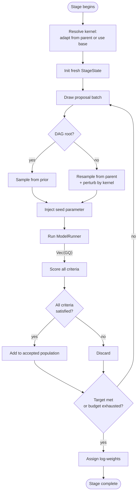

[← Error Propagation and Stage Resumability](14-error-propagation-and-stage-resumability.md) | [TOC](README.md) | [Next: Runtime Execution →](16-runtime-execution.md)

---

## 15. ABC Rejection Sampling Stage Execution

`Context` drives the rejection-sampling loop for each `StageNode` in topological order ([§3](03-simulation-system-and-dag-stages.md)). Before the loop begins it resolves the effective perturbation kernel and scorer for that node, initialises a fresh `StageState`, and checks whether a `StageCheckpoint` from a previous run should be loaded ([§15](15-abc-rejection-sampling-execution.md)). The loop runs until `m` particles pass the `ScoreAcceptanceCriterion` or `PopulationBudget::max_proposals` is reached.

---

#### Pre-loop setup

The effective kernel for the node is `StageNode::perturbation_override` when present, otherwise `CalibrationManifest::root_perturbation_kernel`. When `PerturbationInheritance::AdaptFromParent` is set and the node has a parent, `base_kernel.adapt(&prev)` produces an updated `PerturbationType` from the parent stage's accepted population slice. For the root stage or `Fixed` inheritance the base kernel is used directly. In both cases the result is written into `node.realized_kernel` (in-memory) and `ExperimentManifest::realized_kernels` (persistence) before the loop begins (see [§6](06-perturbationkernel-and-density-convention.md), Between-Stage Adaptation Lifecycle).

```rust
// Resolve the effective kernel for this stage.
// Per-stage override takes precedence over the root kernel.
let base_kernel = node.perturbation_override.as_ref()
    .unwrap_or(&manifest.root_perturbation_kernel);

let kernel: PerturbationType =
    if matches!(manifest.perturbation_inheritance, PerturbationInheritance::AdaptFromParent)
    && node.parent_id.is_some()
    {
        let prev = stage_states[&parent_id].accepted.as_slice();
        base_kernel.adapt(&prev)
    } else {
        base_kernel.clone()
    };

// Record the realized kernel in both the in-memory node and the persisted manifest.
node.realized_kernel = Some(kernel.clone());
experiment_manifest.realized_kernels.insert(node.id.clone(), kernel.clone());

// Fresh StageState (or reload from StageCheckpoint when resuming)
let mut state = StageState {
    node_id:               node.id.clone(),
    scores:                HashMap::new(),
    score_provenances:     HashMap::new(),
    accepted:              ParticlePopulation::new(),
    failures:              HashSet::new(),
    budget_exhausted:      false,
    model_state_refs:      HashMap::new(),
    counterfactual_labels: HashMap::new(),
};
let mut population   = ParticlePopulation { entries: HashMap::new() };
let mut n_proposed: usize = 0; // running total across all batches this stage

// Build the variant population once per stage for Iterator-mode counterfactuals.
// Each variant particle carries its label embedded under the reserved
// "__variant_label__" key; SimulationBuilder strips it before model execution
// and surfaces it in SimulationResult::counterfactual_labels after the run.
// Selector mode and stages without counterfactuals set this to None.
let variant_population: Option<ParticlePopulation> =
    match &manifest.counterfactuals {
        Some(CounterfactualGroup { mode: CounterfactualMode::Iterator, variants }) => {
            let entries = variants.iter()
                .map(|(label, particle)| {
                    let mut p = particle.clone();
                    p.0.insert("__variant_label__".to_string(), serde_json::json!(label));
                    let id = p.fingerprint();
                    (id, WeightedParticle { particle: p, log_weight: 0.0 })
                })
                .collect::<HashMap<_, _>>();
            Some(ParticlePopulation { entries })
        }
        _ => None,
    };
```



---

#### Step 1 — Build a proposal batch

Proposals are drawn in batches whose size is an internal `Context` heuristic; a sensible default is `min(target_accepted * n, remaining_budget)` where `n` is informed by the acceptance rate and `remaining_budget = max_proposals.unwrap_or(usize::MAX) − n_proposed`. It is recommended to run a prior predictive check to inform the batching for early stages of calibration so that score quantiles can inform dynamic batching.

**DAG root** (`node.parent_id.is_none()`): particles are drawn directly from the prior. `CalibrationManifest::prior_set` is a serialised JSON object; `Context` deserialises it into live distribution objects at run time.

```rust
// Root stage — sample each parameter from its prior distribution
let proposed: FlatParticle = prior.sample(&mut rng);
```

**Non-root node**: a particle is resampled from the parent stage's accepted `PopulationSlice` with probability proportional to its normalised log-weight, then perturbed by the effective kernel.

```rust
// Non-root stage — resample and perturb
let prev = stage_states[&parent_id].accepted.as_slice();
let sampled: &WeightedParticle   = weighted_sample(&prev, &mut rng);
let proposed_particle: FlatParticle        = kernel.perturb(&sampled.particle, &mut rng);s
```

`weighted_sample` draws using the `log_weight` fields — already normalised by `assign_weights` at the end of the parent stage.

---

#### Step 2 — Inject seeds

When a seed parameter has been declared via `Context::seed_param` ([§2](02-calibrator-construction.md)), `SeedKernel::perturb` ([§7](07-nestedsuffixparser-and-particleerror.md)) has already either retained the parent's seed key or removed it from the proposal at a rate of `1.0 - prob_keep`. Proposals from the root stage never carry a seed key (the prior has no seed parameter). Step 2 starts the `SimulationBuilder` for the batch and attaches a seed-injection step via `MergeStrategy::PreferLeft`: proposals that already carry a seed key keep it; proposals where the key is absent receive a value derived from `base_seed`.

Before building the `SimulationBuilder`, `Context` sets its internal proposal offset to `n_proposed` — the running count of proposals already submitted earlier in this stage. This causes `current_proposal_offset()` ([§3](03-simulation-system-and-dag-stages.md)) to return `n_proposed` for the duration of this builder chain. Because particles are sorted lexicographically by `ParticleId` inside the private implementation ([§6](06-perturbationkernel-and-density-convention.md)), the particle at batch position `i` receives global index `n_proposed + i`. This makes every seed within a stage unique regardless of how `Context` divides the loop into batches, and stable under task reordering or retry ([§16.1](16-runtime-execution.md#161-runbuilder)).

**Single replicate (default):** Each particle receives one derived seed, `derive_seed(base_seed, n_proposed + i, 0)` ([§14](14-error-propagation-and-stage-resumability.md)). `Context` uses the private `random_particles_with_offset` directly since `n_proposed` is already known at the call site.

```rust
// Context sets its internal offset before building the SimulationBuilder:
self.update_proposal_offset(n_proposed as u64);
let sim = self.simulate()
    .from_population(batch)
    .random_particles(); // derives offset from ctx.current_proposal_offset()
```

**Multi-replicate:** Each particle is expanded into `n_replicates` variants. The particle at batch position `i` receives the same seed for each replicate `r` based on `derive_seed(base_seed, n_proposed, r)` ([§13](13-seeds-and-rng-discipline.md)).

```rust
self.update_proposal_offset(n_proposed as u64);
let sim = self.simulate()
    .from_population(batch)
    .replicate_counterfactuals(n_replicates); // derives offset from ctx.current_proposal_offset()
```

In both modes, seed assignment is an injective function of `(base_seed, n_proposed + batch_pos, replicate_idx)` for proposals that receive a derived seed. The `SeedKernel` culling in Step 1 and the `PreferLeft` merge in Step 2 are the only two sites that determine whether a given proposal keeps or replaces its seed. The `sim` builder is completed in Step 4.

---

#### Step 3 — Expand counterfactuals (Iterator mode)

When `variant_population` is `Some`, `Context` chains `.counterfactuals` onto the builder. Each seeded proposal is crossed with every variant via `ParticlePopulation::product` ([§6](06-perturbationkernel-and-density-convention.md)) using `PreferRight`, so variant keys overwrite matching proposal keys. Embedded variant labels are stripped from the particle before model execution and surfaced in `SimulationResult::counterfactual_labels` ([§16.2](16-runtime-execution.md#162-simulationresult)) after the run.

```rust
if let Some(&vp) = variant_population {
    sim = sim.counterfactuals(vp.clone(), MergeStrategy::PreferRight);
}
```

`Selector` mode does not produce this expansion. The variant index is a calibrated discrete parameter inside the particle itself, perturbed by `ModelSelectorKernel` ([§6](06-perturbationkernel-and-density-convention.md)). `Context` resolves the integer to the appropriate variant overlay at parse time. Because of this difference, `Iterator` counterfactuals use the same seed for each calibration proposal, even though the parameters differ. `Selector` counterfactuals do not necessarily have the same seeds within the same stage because they are perturbed at the same time as seed.

---

#### Step 4 — Parse, run, and score

`Context` completes the `SimulationBuilder` chain started in Step 2, attaching the scorer and target resolved from the stage node. The seeded and counterfactual-expanded population is already carried by `sim`. The stage's scorer label is resolved from `StageNode::scorer_fingerprint` and supplied via `.scorer()`. When `StageNode::model_state_policy` is not `None`, `Context` dispatches to the appropriate `ModelRunnerProtocol` method (`run_partial`, `run_from_state`) rather than `run`; the builder selects the correct dispatch based on the stage node supplied internally. All config files, model output files, and score provenance records land under `{artifact_root}/{stage_id}/{orig_id}/` ([§13](13-seeds-and-rng-discipline.md)).

```rust
// Complete the SimulationBuilder chain from Step 2.
// All scorers declared in the stage's scorer_criteria are evaluated against the same
// model outputs; each scorer's results are keyed by its fingerprint in SimulationResult.
let sim_result = sim
    .scorers(&node.scorer_criteria)
    .run().await?;

// Absorb per-scorer scores, provenances, and failures into StageState.
// scores: HashMap<ParticleId, HashMap<Fingerprint, ScoreValueType>>
for (particle_id, scorer_scores) in sim_result.scores {
    state.scores.entry(particle_id).or_default().extend(scorer_scores);
}
for (particle_id, scorer_provs) in sim_result.score_provenances {
    state.score_provenances.entry(particle_id).or_default().extend(scorer_provs);
}
state.failures.extend(sim_result.failures);

// When ModelStatePolicy is Checkpoint or ResumeAndCheckpoint, absorb
// intermediate runner state refs for use by child stages
state.model_state_refs.extend(sim_result.model_state_refs);

// Absorb Iterator-mode counterfactual labels produced by Step 3's product expansion.
// Empty when no counterfactuals were applied or when in Selector mode.
state.counterfactual_labels.extend(sim_result.counterfactual_labels);

// Populate the accumulating proposal population with successfully scored particles
population.entries.extend(sim_result.population.entries);
```

`record_failure` groups identical `RunStageError` variants into `state.failures` (via `sim_result.failures`) so that only unique error shapes surface — not one entry per failing particle ([§15](15-abc-rejection-sampling-execution.md)).

---

#### Step 5 — Checkpoint

After each work item (`CheckpointPolicy::Particle`), after each batch (`ParticleBatch`), or after the full loop (`Stage`), `Context` writes a `StageCheckpoint` to `ArtifactStore` and updates `ExperimentManifest::stage_checkpoints`. When a run is resumed via `RunBuilder::resume_from` ([§16.1](16-runtime-execution.md#161-runbuilder)), `Context` calls `StageCheckpoint::validate_resume` to confirm the manifest fingerprint has not changed, then pre-populates `population.entries` and `state.scores` from the checkpoint and skips any `orig_id` already present in `completed_particle_ids`.

```rust
// Called after each batch under CheckpointPolicy::ParticleBatch
let checkpoint = StageCheckpoint {
    stage_id:               node.id.clone(),
    manifest_fingerprint:   manifest.id.clone(),
    completed_particle_ids: state.scores.keys().cloned().collect(),
    current_population:     population.clone(),
    scores:                 state.scores.clone(),
    failures:               flatten_failures(&state.failures),
    timestamp:              Utc::now(),
};
artifact_store.put_checkpoint(&checkpoint)?;
experiment_manifest.stage_checkpoints.insert(node.id.clone(), checkpoint);
```

---

#### Step 6 — Check termination

After each batch, `population.filter` checks whether `m` particles have passed the criterion. `state.scores` is passed in directly — scores are never stored inside `ParticlePopulation`.

```rust
let n_accepted = population
    .filter(&state.scores, &node.scorer_criteria, None)
    .particles.len();

if n_accepted >= node.population_budget.target_accepted {
    break;
}
if let Some(max) = node.population_budget.max_proposals {
    if n_proposed >= max {
        state.budget_exhausted = true;
        break;
    }
}
```

---

#### Step 7 — Assign weights and emit `CalibrationStageResult`

Once the loop exits, the accepted population is filtered to exactly `m` entries, cloned into an owned `ParticlePopulation` via `PopulationSlice::to_owned_population`, and passed to `assign_weights` ([§5](05-particlepopulation-weights-and-product.md)).

For the root stage `prev = None` and uniform log-weights are assigned. For subsequent stages `prev = Some((parent_slice, &*kernel))` triggers the full ABC-SMC importance-weighting formula, using a `PopulationSlice` view obtained via `as_slice()` from the parent stage's owned `ParticlePopulation` held in `stage_states[parent_id].accepted`.

```rust
let accepted_slice = population.filter(
    &state.scores,
    &node.scorer_criteria,
    Some(node.population_budget.target_accepted),
);
let mut accepted_pop = accepted_slice.to_owned_population();

let perturbation_weight_calculator = node.parent_id.as_ref().map(|pid| {
    let prev_particles = stage_states[pid].accepted.as_slice();
    (prev_particles, &kernel as &dyn PerturbationKernel)
});
accepted_pop.assign_weights(|p| prior.log_prob(p), perturbation_weight_calculator);

// Store the final accepted population in the stage's runtime state
state.accepted = accepted_pop;

let result = CalibrationStageResult {
    stage_id:         node.id.clone(),
    accepted:         state.accepted.clone(),
    scores:           state.scores.clone(),
    failures:         state.failures.iter().cloned().collect(),
    budget_exhausted: state.budget_exhausted,
};
```

`Context` absorbs `result` into `stage_states[&node.id]`, runs `DiagnosticsStageResult` computation ([§3](03-simulation-system-and-dag-stages.md)), writes into `ExperimentManifest::diagnostics` and `posterior_artifacts`, then advances to the next DAG node in topological order.

---

### 15.1 Execution Modes

The proposal batch loop above is execution-mode agnostic: it builds `work_items` and collects scored entries. The three modes differ only in how step 4's `parse → run → score` block is dispatched. `Context` selects the mode based on the `ModelRunnerProtocol` implementation; the loop structure is unchanged.

#### Serial

Each work item is processed sequentially on the calling thread. Useful for runners that are already internally parallel (GPU-resident simulators, multi-threaded process pools) or for deterministic debugging.

```rust
for item in work_items {
    let result = execute_item(&item, &*runner, &*scorer, ...).await;
    record_result(result, &mut state, &mut population);
}
```

#### Local Parallel (Tokio)

Each work item is dispatched as a `tokio::spawn` task and collected via `JoinSet`. The runner and scorer are shared across tasks via `Arc`. Concurrency is bounded by a semaphore held internally by `Context`, preventing unbounded task growth under large budgets.

```rust
let runner = Arc::clone(&self.runner);
let scorer = Arc::clone(&self.scorer);
let sem    = Arc::clone(&self.concurrency_semaphore); // internal to Context

let mut join_set = tokio::task::JoinSet::new();

for item in work_items {
    let (runner, scorer, sem) = (Arc::clone(&runner), Arc::clone(&scorer), Arc::clone(&sem));
    join_set.spawn(async move {
        let _permit = sem.acquire().await;
        execute_item(&item, &*runner, &*scorer, ...).await
    });
}

while let Some(result) = join_set.join_next().await {
    record_result(result?, &mut state, &mut population);
}
```

Because `derive_seed` ([§13](13-seeds-and-rng-discipline.md)) is a pure function of `(base_seed, stage_global_idx, replicate_idx)`, seeds are stable under task reordering: a task that completes out of order, is retried, or is rescheduled always hashes to the same seed for its `particle_idx`, regardless of `JoinSet` completion order.

#### Cloud Parallel

The runner dispatches work items to a remote scheduler (job queue, message broker, serverless function) and returns a future that resolves when the remote job completes. From `Context`'s perspective the dispatch is identical to the local parallel path: it awaits `ModelRunnerProtocol::run` and records the result. Cloud semantics are entirely encapsulated inside the runner.

```rust
struct CloudRunner { queue: Arc<JobQueue> }

#[async_trait::async_trait]
impl ModelRunnerProtocol for CloudRunner {
    type Config = serde_json::Value;
    type Output = SimOutput;
    type State  = ();

    async fn run(&self, config: &Self::Config, output_dir: &Path) -> Result<Self::Output, ModelRunError> {
        let job_id = self.queue.submit(config, output_dir).await
            .map_err(|e| ModelRunError::Io(e.to_string()))?;
        self.queue.wait(job_id).await
            .map_err(|e| ModelRunError::Io(e.to_string()))
    }
}
```

The concurrency semaphore in `Context` becomes a cloud-concurrency throttle. Because `output_dir` is `{artifact_root}/{stage_id}/{particle_id}/` ([§12](12-modelrunner.md)), cloud workers write output files to the same content-addressed location that `ArtifactStore::get` reads, so cloud and local runs share the same artifact layout. Seed stability under cloud re-queueing follows the same logic as local task reordering: `particle_idx` is the proposal counter at the point the work item was **created**, not when the remote job completes, so a re-queued job receives the same `derive_seed` result as its first attempt.

---

[← Error Propagation and Stage Resumability](14-error-propagation-and-stage-resumability.md) | [TOC](README.md) | [Next: Runtime Execution →](16-runtime-execution.md)
